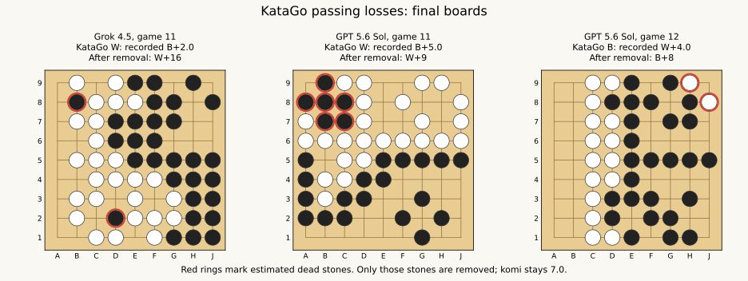

# KataGo passing audit — 2026-09-04

This audit does not alter arena settings, old results, or Elo estimates.
The machine-readable results are in [passing_audit.json](passing_audit.json);
the replay and scoring procedure is in [audit_passing.py](../../../analysis/audit_passing.py).

Follow-up: [visit-budget experiment](passing_visits.md) tests all 13 legal
flagged positions at 1, 5, 10, 20, 50, 100, and 200 visits. Increased search
reduces the observed errors but does not eliminate them at 200; a focused
1,000-visit check is also recorded. The 64-visit retry below remains a proposal,
not a validated solution.

## Results

Both judging networks flag **the same 18 games** after checking all 102
candidate positions. They also agree on the removed stones and resulting
scores for those 18 games.

| Population | Passing losses that flip to wins | Frequency |
| --- | ---: | ---: |
| All canonical LLM–KataGo games | 18 / 438 | 4.11% |
| LLM–KataGo games without superko violations | 13 / 343 | 3.79% |
| All recorded KataGo losses against LLMs | 18 / 231 | 7.79% |
| KataGo losses against LLMs ending in two passes | 18 / 102 | 17.65% |
| Historical native `katago match` games | Not measurable / 310,738 | Unknown |

In **16/18** flagged games KataGo passed first and the LLM passed back; in
**2/18** KataGo supplied the second pass. Five flagged games have an earlier
superko violation. Two additional losses become draws after estimated dead
removal; they are not included in the 18.

Examples, all without superko violations:

| Run and game | KataGo | Recorded result | Score after estimated dead removal |
| --- | --- | --- | --- |
| `arena_20260731_044901_270838_7068701f`, game 11 | White vs Grok | B+2 | W+16 |
| `arena_20260827_231719_610088_eb49a7a4`, game 11 | White vs GPT | B+5 | W+9 |
| `arena_20260827_231719_610088_eb49a7a4`, game 12 | Black vs GPT | W+4 | B+8 |



## Elo of the 18 opponents

These are the saved end-of-run Elo estimates from each game's own `run.json`,
on the arena scale where `kata1-random = 0`. They are not external training
ratings or a fresh fit. Exact temperature variants are matched. All 18 players
used one visit. Full identifiers and confidence intervals are in
[passing_audit_elos.csv](passing_audit_elos.csv).

| Run (UTC, 2026) | Game | b6c96 checkpoint | Temperature | Elo |
| --- | ---: | --- | ---: | ---: |
| 07-23 17:37 | 5 | s16525312 | 0.1 | 2262 |
| 07-23 20:59 | 13 | s8982784 | 0.3 | 1536 |
| 07-23 20:59 | 15* | s10014464 | 0.3 | 1636 |
| 07-31 04:49 | 11 | s6127360 | 0.1 | 1262 |
| 08-07 18:45 | 6 | s11888896 | 0.5 | 1743 |
| 08-07 18:45 | 13 | s12849664 | 0.1 | 1945 |
| 08-07 22:35 | 10 | s11888896 | 0.5 | 1743 |
| 08-07 22:35 | 19 | s8080640 | 0.3 | 1413 |
| 08-07 22:35 | 21 | s8982784 | 0.1 | 1574 |
| 08-17 06:55 | 5 | s6127360 | 0.9 | 640 |
| 08-18 02:11 | 25* | s8982784 | 0.5 | 1365 |
| 08-18 03:58 | 10* | s14649344 | 0.3 | 2085 |
| 08-18 03:58 | 14* | s13733120 | 0.3 | 1986 |
| 08-26 05:49 | 27 | s13733120 | 0.3 | 1986 |
| 08-26 18:54 | 8* | s14649344 | 0.3 | 2085 |
| 08-27 23:17 | 5 | s18429184 | 0.1 | 2387 |
| 08-27 23:17 | 11 | s14649344 | 0.3 | 2085 |
| 08-27 23:17 | 12 | s14649344 | 0.3 | 2085 |

*An earlier superko violation occurred in this game.*

## What is being counted

A candidate is a recorded LLM–KataGo game that ended with two consecutive
passes and a KataGo loss. Both terminal passes leave the board unchanged.
For each candidate, replay the complete game, verify the final board and
recorded score against KataGo 1.16.5, estimate dead stones, remove those stones
from a copy of the final board, and calculate the exact area score with the
original komi. Count it only if that counterfactual score is a **KataGo win**.
Changes from losses to draws are recorded separately.

The dead-stone estimator is KataGo's `final_status_list dead` with
`friendlyPassOk=true`, using 100 visits. All other rules and the complete move
history are retained. This rule switch is local to the audit and enables the
ownership-based status estimator instead of the finished-game pass-alive
status calculation. Two stronger network checkpoints check all candidates:

- `kata1-b10c128-s501483520-d110698189`
- `kata1-b18c384nbt-s9761732864-d4253420187`

The JSON records model hashes, dead coordinates, counterfactual scores, pass
order, and superko violations. Death classification is an **engine estimate**,
not a proof of life and death or of a winning continuation against perfect
defense. The procedure changes no komi, awards no territory beyond ordinary
area scoring, and does not count games that merely have a favorable predicted
score without a winning score after dead-stone removal.

Reproduce with the two model files cached under `.venv/katago/networks/kata1/`:

```bash
.venv/bin/python audit_passing.py --models \
  .venv/katago/networks/kata1/kata1-b10c128-s501483520-d110698189.txt.gz \
  .venv/katago/networks/kata1/kata1-b18c384nbt-s9761732864-d4253420187.bin.gz
```

## Coverage

There are 438 complete, canonical LLM games: 195 KataGo wins, 231 KataGo
losses, and 12 draws. Of these, 306 ended with two passes: 192 wins, 102 losses,
and 12 draws. The remaining 132 ended by resignation and are outside this
terminal-passing criterion.

Earlier positional-superko violations occur in 95 games. The legal-history
subset contains 343 games, including 182 KataGo losses and 79 losses ending
with two passes. The audit retains the historical games but flags their
violations; they should not be treated as valid strict-superko evaluations.

The four historical KataGo-only runs contain **310,738 `katago_match` games**
and 9,262 `uniform_random` games. Native matches comprise 96,631 scored games
and 214,107 resignations. The four native run directories are absent from
`untracked_log/` in this checkout; their tracked CSVs contain move counts but
not moves or final boards. Consequently, the historical native-match failure
rate is **not measurable from the available records**. The scored-game count
is not a count of passing failures, and no LLM-game rate can be substituted.

## Scoring and command differences

The prompt says strict Tromp–Taylor with no dead-stone removal, but
`game_engine.py` obtains results from KataGo's `final_score`. That scorer
recognizes stones inside opposing pass-alive territory. It does **not** remove
every stone that a strong player would judge dead. Independent literal
Tromp–Taylor scoring differs from four recorded LLM-game scores; none of those
four differences changes the winner. [KataGo's version-2 rules](https://lightvector.github.io/KataGo/rulesv2.html),
[1.16.5 GTP scoring implementation](https://github.com/lightvector/KataGo/blob/v1.16.5/cpp/command/gtp.cpp).

Native `match` games also terminate automatically when every point is
pass-alive. GTP additionally applies a pre-pass cleanup step, limited to
opposing stones in the player's pass-alive territory. Thus neither training
nor native matches can accurately be described as automatically removing
*all* dead groups. [Native game loop](https://github.com/lightvector/KataGo/blob/v1.16.5/cpp/program/play.cpp),
[cleanup and status implementations](https://github.com/lightvector/KataGo/blob/v1.16.5/cpp/program/playutils.cpp).

GTP defaults to `conservativePass=true`; native search parameters default to
`false`. Despite its name, `true` makes a root pass non-terminal in search,
even when it would end the real game. `friendlyPassOk=false` and the automatic
cleanup behavior are already in effect for Tromp–Taylor GTP play. Simply
turning cleanup on therefore does not address the unresolved groups found
here. [GTP defaults](https://github.com/lightvector/KataGo/blob/v1.16.5/cpp/command/gtp.cpp),
[search defaults](https://github.com/lightvector/KataGo/blob/v1.16.5/cpp/search/searchparams.cpp),
[terminal-pass handling](https://github.com/lightvector/KataGo/blob/v1.16.5/cpp/search/search.cpp).

## Recommended treatment

For a benchmark of general Go ability, improve the KataGo baseline's passing
behavior. For a benchmark explicitly of these one-visit policies under the
specified rules, passing errors are part of the measured behavior. In either
case, preserve existing results and label any changed baseline separately.

1. Make the stated scoring rule and the actual scorer agree, across both
   native matches and LLM games. Specify whether the intended rule includes
   KataGo's pass-alive simplification.
2. Set `conservativePass=false` for competitive play with exact terminal
   scoring, and keep friendly passing disabled. This alone cannot solve a
   one-visit policy's failure to examine the consequences of its pass.
3. Test a bounded verification search whenever KataGo proposes **any** pass
   while losing under the current terminal score. A 64-visit retry is a
   reasonable starting experiment; disable the normal after-pass search
   reductions for that retry so it receives the full budget. It should seek a
   legal continuation when
   the model believes it is ahead but the current board scores as a loss;
   allow resignation or a pass when verification also judges the game lost.
   Measure interventions and remaining failures before adopting a threshold.
4. Apply the same player behavior to KataGo–KataGo calibration. A Python GTP
   pass guard does not apply to the native `match` loop: either reproduce the
   guard there or run calibration through the same GTP player wrapper.
   Recalibrate ratings after changing the players.

As a small diagnostic, on game 12 of
`arena_20260827_231719_610088_eb49a7a4`, the original network and temperature
sampled passes in 2/20 one-visit searches with `conservativePass=true` and
3/20 with `false`. At 64 visits it sampled no passes in 20 searches under
either setting. Search randomization was fixed for the experiment and the
move-temperature sampling remained enabled. This is one-position evidence,
not a measured general repair rate.

Do not retroactively replace the benchmark results with the audit's estimated
dead-stone scores. Unsettled fights, seki, and ko make a heuristic death judge
an inappropriate substitute for an exact referee.

## Follow-up: making calibration and LLM opponents identical

The simplest design is to play both types of game through the same Python
game loop and GTP strategy. That gives one player implementation and one
referee, but gives up the native match command's model sharing and batching
advantages. Its performance cost should be measured before adopting it for
hundreds of thousands of calibration games.

If native throughput is required, use a pinned KataGo fork with a shared C++
competitive-player decision function. Both `cpp/command/gtp.cpp` and the
non-self-play match path in `cpp/program/play.cpp` must call it before committing
the move. It must own ordinary search, pass cleanup, pass verification, and
resignation; copying a Python guard into a separate C++ implementation would
leave two implementations that can drift.

An initial bounded policy would be:

1. Obtain the ordinary one-visit candidate without playing it.
2. If it is not a pass, return it using the usual resignation handling.
3. For a proposed pass, calculate the score of ending immediately on a copy of
   the current position and history, using the actual terminal scorer.
4. If the mover would lose, run a fresh 64-visit search with the same network,
   `conservativePass=false`, and no after-pass or winning-position budget
   reductions. Replace the original candidate with the verified decision.
   Apply this once per turn; it must not recursively retrigger itself.
5. Commit only the final move. The speculative pass never enters either
   player's history, superko history, or consecutive-pass counter.

This is an adaptive-search player, not a guarantee against all passing errors.
The first version should allow the verification search to choose pass or
resign if it still judges the game lost. A permanent ban on passing while
behind can prolong hopeless games or merely turn a mistaken pass into a
mistaken resignation. The 64-visit setting needs testing on all 13 legal
flagged positions and on ordinary losing and winning endgames, not just the
single position already probed. Use the player's original network, not the
much stronger networks used to audit the results.

Two scoring details matter:

- Calling GTP `final_score` before the game is finished does not supply this
  exact check: KataGo estimates the score in that case. Use a shared exact
  score-now helper on a copied board/history instead.
- For minimal disruption, retain KataGo's existing pass-alive scoring variant
  and disclose it accurately in the prompt. If literal no-removal
  Tromp–Taylor is required instead, modify the shared C++ terminal scorer used
  by both MCTS and final adjudication. Changing only Python's final score
  would leave the search optimizing a different terminal payoff.

Pin one effective policy profile: engine/model hashes, rules/komi, temperatures,
ordinary and verification budgets, all search-budget reductions, pass options,
resignation logic and thresholds, tree reuse, and randomness. Disable native
all-pass-alive early termination for this common two-pass game loop, or
implement exactly that same early termination in GTP games. GTP-only cleanup
must also move into the shared function; equal search parameters do not imply
equal final moves when post-processing differs.

Validate parity using identical saved positions **and full histories**, both
colors, first-pass and second-pass cases, resignation cases, and move-cap
restarts. With fixed per-game seeds, fixed NN symmetry and one search thread
on the same backend, compare the candidate, exact score, retry decision,
search budget, final move, and terminal result from both entry points. Repeat
through multi-move games to catch history, tree-reuse and resignation-counter
differences. Parallel/GPU executions may differ numerically; consistent
policy semantics should not be represented as a promise of bitwise-identical
games across backends.

Record the policy version/profile hash in manifests and reject incompatible
run extensions. Give these hybrid players distinct identities, such as
`...-passcheck64`, since they are no longer pure one-visit players. Collect
calibration games involving the new variants; old variants may remain as
unchanged anchor opponents, but their Elo cannot be assigned to the new
variants without calibration.
